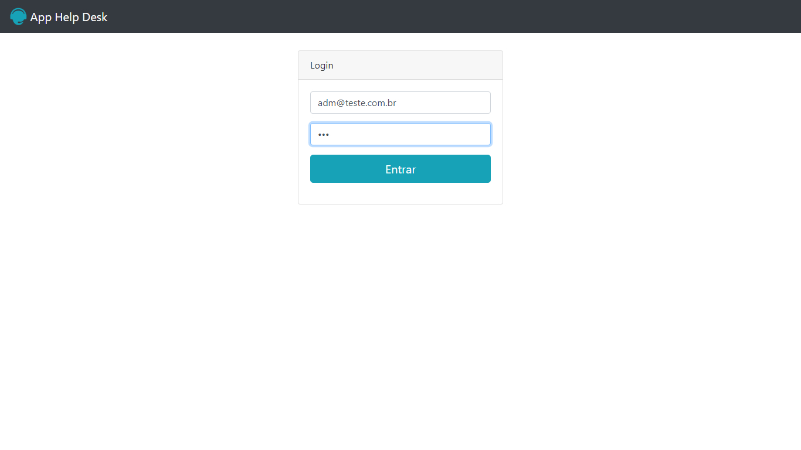

# Projeto autenticação

## Projeto feito com base em um curso na plataforma Udemy com o instrutor Jorge Sant Ana para autenticação de perfis administrativos e de usuários.
---
## Ideias iniciais do projeto:
- Familiarização com a sintaxe básica do PHP

- Entendimento dos Metódos GET E POST
- Compreender mais afundo a comunicação do Front e o Back da aplicação.
- Utilição de arrays para armazenamento de dados

---
## Tecnologias Utilizadas:
- HTML
- BOOTSTRAP
- PHP
---
## RESUMO:
Foi um projeto relativamente simples para fortalecer o meu entendimento com páginas dinâmicas utilizando PHP para ser a linguagem do lado do servidor (APACHE) 
